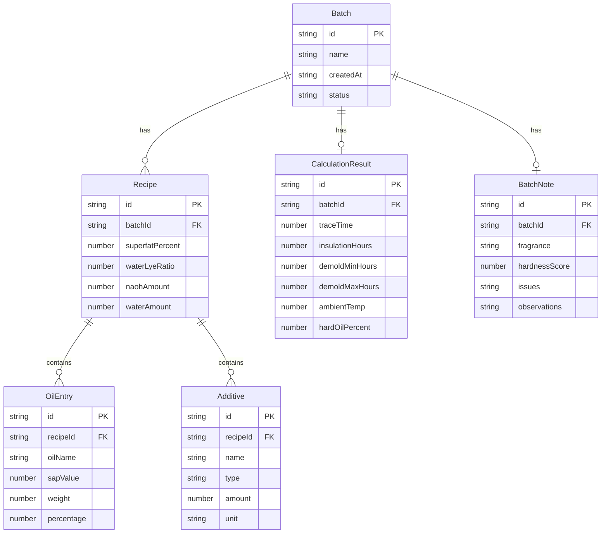

## 1. 架构设计

```mermaid
graph TD
    "React前端" --> "Zustand状态管理"
    "Zustand状态管理" --> "LocalStorage持久化"
    "React前端" --> "皂化计算引擎"
    "皂化计算引擎" --> "油品数据库"
    "皂化计算引擎" --> "可配置公式参数"
    "React前端" --> "React Router"
    "React Router" --> "配方页"
    "React Router" --> "计算页"
    "React Router" --> "批次笔记页"
    "React Router" --> "历史页"
    "React Router" --> "导出页"
```

## 2. 技术说明

- **前端**: React@18 + TypeScript + Tailwind CSS@3 + Vite
- **初始化工具**: vite-init (react-ts模板)
- **后端**: 无（纯前端应用）
- **数据库**: LocalStorage（批次历史持久化）
- **状态管理**: Zustand
- **路由**: React Router DOM v6
- **图标**: lucide-react

## 3. 路由定义

| 路由 | 用途 |
|------|------|
| / | 重定向到 /recipe |
| /recipe | 配方页：油品选择、比例设定、碱液计算 |
| /calculation | 计算页：皂化进度、脱模窗口、倒计时 |
| /notes | 批次笔记页：香气、硬度、问题记录 |
| /history | 历史页：批次列表、批次对比 |
| /export | 导出页：JSON导出 |

## 4. 数据模型

### 4.1 核心数据模型定义



### 4.2 油品数据库（预置数据）

| 油品名称 | 皂化值(NaOH) | 类别 | 硬度贡献 |
|----------|-------------|------|----------|
| 橄榄油 | 0.134 | 软油 | 低 |
| 椰子油 | 0.183 | 硬油 | 高 |
| 棕榈油 | 0.141 | 硬油 | 高 |
| 乳木果油 | 0.128 | 硬油 | 中 |
| 甜杏仁油 | 0.136 | 软油 | 低 |
| 蓖麻油 | 0.128 | 软油 | 低 |
| 葵花籽油 | 0.134 | 软油 | 低 |
| 米糠油 | 0.128 | 软油 | 低 |
| 可可脂 | 0.137 | 硬油 | 高 |
| 棕榈仁油 | 0.156 | 硬油 | 高 |

### 4.3 皂化计算公式参数（可配置）

| 参数 | 默认值 | 说明 |
|------|--------|------|
| baseTraceTime | 45分钟 | 基础Trace时间(分钟) |
| tempCoefficient | 0.03 | 温度修正系数(每度) |
| referenceTemp | 25°C | 参考温度 |
| hardOilSpeedFactor | 0.6 | 硬油加速因子 |
| softOilSlowFactor | 1.4 | 软油减速因子 |
| defaultInsulationHours | 24 | 默认保温时长(小时) |
| demoldMinBase | 24 | 最短脱模时间(小时) |
| demoldMaxBase | 72 | 最长脱模时间(小时) |
| defaultWaterLyeRatio | 2.5 | 默认水碱比 |

## 5. 状态管理设计

使用Zustand管理全局状态：

- **currentBatch**: 当前批次数据（配方、计算结果、笔记）
- **batchHistory**: 所有已保存批次列表
- **oilDatabase**: 油品数据库
- **formulaConfig**: 可配置公式参数
- **actions**: 创建/更新/删除批次、更新配方、计算结果等
